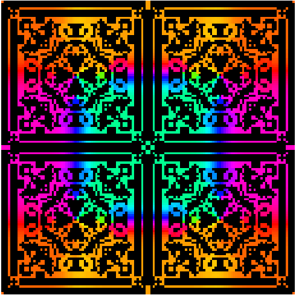

# KaleidoCA: Kaleidoscopic Symmetry using Moore's Neighbor

## Overview

**KaleidoCA** is a 2D CA that generates kaleidoscopic patterns through mirrored grids, utilizes Moore's Neighbor for rules and take the cell's angle to generate hue based form hsv.

---

## Key Features

- **Kaleidoscopic Symmetry**: Mirrored grid across four quadrants.
- **Cellular Automaton**: Rules based on neighboring cells' count and hue.
- **Interactive GUI**: Real-time control for stepping, playing, resetting, and randomizing.
- **Save & Export**: Save the current state of the kaleidoscope as a PNG image.

---

## Dependencies
- `numpy`: Grid data and calculations
- `matplotlib`: Rendering the plot and saving images
- `tkinter`: GUI interface
- `ipywidgets`: Interactive jupyter noteobok

Install dependencies either through bash or notebook with:

```python
pip install -r requirements.txt
```

## How It Works

### 1. Grid Initialization

- The grid starts at a default size of **64x64**.
- The automaton operates on a **single quarter** mirrored of the grid.
- This quarter is **mirrored** across both axes to generate the full symmetrical grid.
- A **random hue** (hsv color from matplotlib)is assigned to the central cell.
- The **3×3 neighborhood** around the central cell is filled with random hues (excluding the center itself).

---

### 2. CA logic

- **Neighborhood**  
  Uses a **Moore neighborhood**, which considers all **8 surrounding cells** (horizontal, vertical, and diagonal neighbors).

- **Color Averaging**  
  Hue blending is performed in the **HSV color space** using **circular averaging**.  basically converts the angle into color from HSV (Hue,Saturation,Value)
  This ensures **smooth color transitions** and avoids sharp changes between hues.

- **Symmetry**  
  The kaleidoscope effect is generated by **reflecting a single quarter** of the grid across the **horizontal and vertical axes**, resulting in a **4-way symmetrical pattern**.


## Rule Explanation

### Color Map
- **Black-to-HSV Gradient**:  
  The colormap starts at black (`0` value) and progresses through the HSV hue spectrum (values `> 0`), giving each cell a radial color.

---

### Hue Averaging
- **Circular Mean of Hues**:  
  Neighbor hues are treated as angles on a unit circle:
  - Hue → angle: `angle = hue × 2π`
  - Mean direction: computed using `sin` and `cos` sums
  - Output: average angle mapped back to hue ∈ [0, 1]

---

### Cell Update Rules
Each cell in the **quarter grid** evolves based on its **Moore neighborhood** (8 surrounding cells):

| Cell State | Neighbor Count | Rule                                                |
|------------|----------------|-----------------------------------------------------|
| Alive      | 1–3            | **Survives** (keeps its hue)                       |
| Alive      | <1 or >3       | **Dies** (value set to `0`)                        |
| Dead       | 1–3            | **Born** with the **average hue** of neighbors     |
| Dead       | <1 or >3       | **Remains dead**                                    |

> **Hue values of 0 are considered dead/empty.**

---

### Symmetry (Kaleidoscopic Effect)
The final grid is created by mirroring the `quarter` grid:

| Quadrant       | Transformation Applied             |
|----------------|-------------------------------------|
| Top-Left       | Original quarter grid              |
| Top-Right      | Horizontal flip                    |
| Bottom-Left    | Vertical flip                      |
| Bottom-Right   | Horizontal + vertical flip         |

These four quadrants are stitched together into a **2×2 grid**, forming the kaleidoscopic pattern.

---

TLDR:

A **3×3 block** centered in the grid is seeded with **random hues**, excluding the center for each quadrant.
  
The CA evolves using the following rules:

- **Start**:  
  A dead cell (value `0`) becomes alive if it has **1, 2, or 3** neighbors with non-zero values.  
  The new cell’s hue is the **average hue** of its neighbors.

- **End**:  
  A cell dies if it has **fewer than 1** or **more than 3** live neighbors.

- **To Survive**:  
  A live cell (non-zero value) remains alive if it has **1, 2, or 3** live neighbors.

---

### 3. Kaleidoscope Grid Construction

To form the kaleidoscope effect, the quarter grid is reflected into four quadrants:

| Quadrant       | Transformation                           |
|----------------|-------------------------------------------|
| Top-left       | Original quarter grid                    |
| Top-right      | Horizontally flipped                     |
| Bottom-left    | Vertically flipped                       |
| Bottom-right   | Horizontally and vertically flipped      |

These are combined to produce the **final symmetrical grid**.

---

### 4. Average Hue Calculation

To blend hues accurately:

1. Treat each hue as an **angle** on the unit circle.
2. Convert each hue to Cartesian coordinates using **sine** and **cosine**.
3. Compute the **average direction** via `atan2(sum(sin), sum(cos))`.
4. Convert the resulting angle back to a hue value between `0` and `1`.

---

## Controls (GUI)

The graphical interface allows full interaction with the automaton:

| Control        | Description                                                           |
|----------------|------------------------------------------------------------------------|
| **Step**        | Advance the simulation by frame by frame                               |
| **Play/Stop**   | Toggle loop of CA                                            |
| **Speed**       | Adjust number of steps per frame at cost                                     |
| **Reset**       | Reset to initial state while preserving color layout                  |
| **Re-Randomize**| Generate a new random grid and seed colors                            |
| **Save Image**  | Export the current pattern as `kaleidoscope_snapshot.png`             |

---

### Color Map

- Custom HSV-based colormap.
- Transitions from **black to vibrant hues**.
- Designed for **smooth visual blending** and clear color transitions.

---

## Example Usage

### Running the Application

```python
import numpy as np
import matplotlib.pyplot as plt
from matplotlib.colors import ListedColormap
import math
import tkinter as tk
from matplotlib.backends.backend_tkagg import FigureCanvasTkAgg
import ipywidgets as widgets
from IPython.display import display

.....

root = tk.Tk()
app = Kaleido(root)
root.mainloop()
```
This will launch a window where you can control the CA's evolution.

If you "Run All Cells" in Jupyter Notebook, the Tkinter window might get covered by other tabs or windows



ENJOY Doc :D

